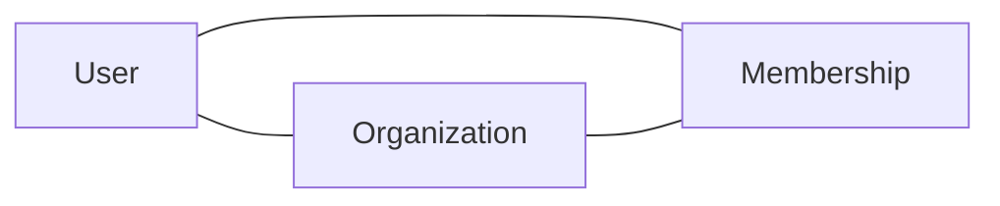

This page documents the primary domain entities. For schema definitions, see the migration files in the Core API repo.

## Core entities

### User

Represents an authenticated person. One user can belong to multiple organizations.

| Field | Type | Description |
|-------|------|-------------|
| `id` | UUID | Primary key |
| `email` | string | Unique, used for login |
| `created_at` | timestamp | Account creation time |
| `last_login_at` | timestamp | Last successful auth |

### Organization

A company or team account. The primary billing and access control boundary.

| Field | Type | Description |
|-------|------|-------------|
| `id` | UUID | Primary key |
| `name` | string | Display name |
| `plan` | enum | `free`, `pro`, `enterprise` |
| `owner_id` | FK → User | Billing owner |

### Membership

Junction table linking users to organizations with a role.

| Field | Type | Description |
|-------|------|-------------|
| `user_id` | FK → User | |
| `org_id` | FK → Organization | |
| `role` | enum | `owner`, `admin`, `member` |
| `joined_at` | timestamp | |

## Relationships

A user can be a member of many organizations. An organization can have many members. The `Membership` table holds the role for each pair.

## Data storage

| Data type | Storage | Notes |
|-----------|---------|-------|
| Relational data | Postgres | Primary store, via Core API |
| Sessions | Redis | TTL-based, auto-expire |
| File uploads | S3-compatible object store | Referenced by URL in Postgres |
| Search index | [Search service] | Synced from Postgres via worker |

## Sensitive fields

The following fields are encrypted at rest and must never appear in logs:

- `User.password_hash`
- Payment method tokens (stored in your payment processor, referenced by ID only)
- Any field containing PII in audit logs

If you're adding a new field that contains PII or credentials, flag it in your PR for security review.
