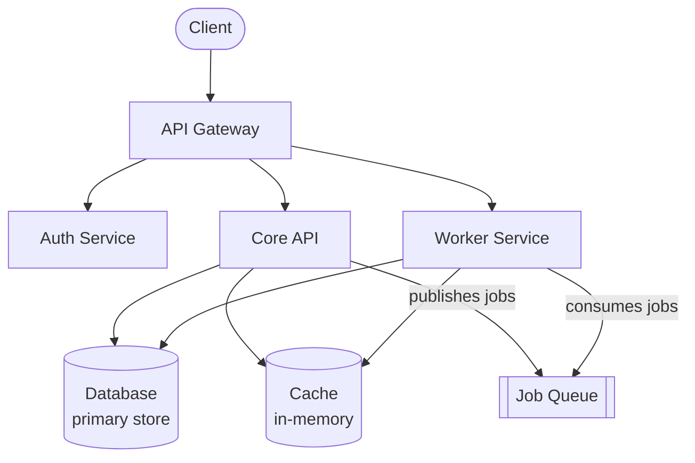

This page gives a high-level map of our backend services. Each service has its own README with deeper documentation.

## Service map

## Services

### API Gateway
The public-facing entry point. Handles routing, rate limiting, and authentication checks before forwarding requests to downstream services. Deployed on [Platform].

**Repo:** `api-gateway`

### Auth Service
Manages user identity, sessions, and permissions. Integrates with your identity provider for SSO. All authentication decisions are delegated here — other services call Auth to validate tokens.

**Repo:** `auth-service`

### Core API
The main application backend. Handles business logic for the primary product domain. Owns the primary database.

**Repo:** `core-api`

### Worker Service
Processes background jobs: email delivery, async data processing, scheduled tasks, and webhook delivery. Consumes from the job queue.

**Repo:** `worker`

## Communication patterns

- **Synchronous:** Services communicate via internal HTTP APIs. Auth headers are passed through and validated at each service boundary.
- **Asynchronous:** Workers consume from the job queue. The Core API publishes jobs; workers process them independently.
- **Events:** Significant domain events (user created, subscription changed) are published to the event bus for downstream consumers.

## Environments

| Environment | Purpose | Access |
|-------------|---------|--------|
| Local | Development | All engineers |
| Staging | Pre-production verification | All engineers |
| Production | Live traffic | Deploy tool only |
